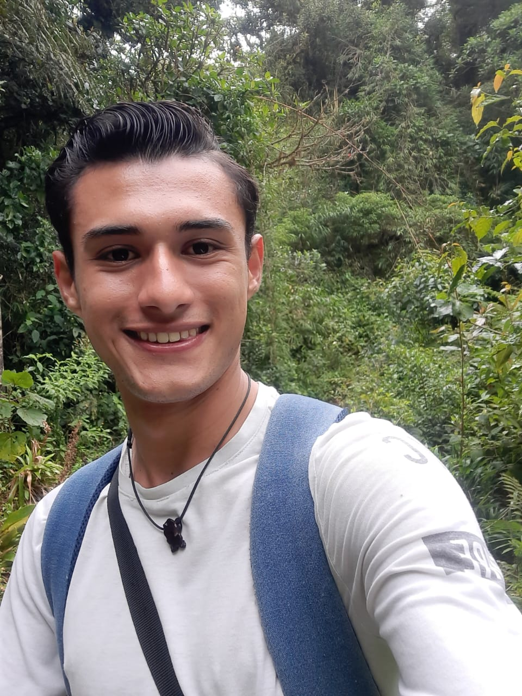
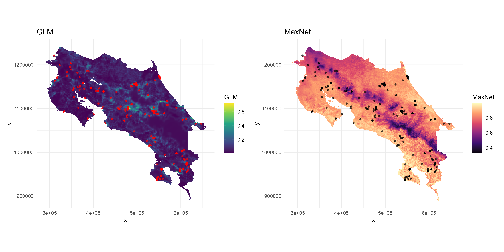
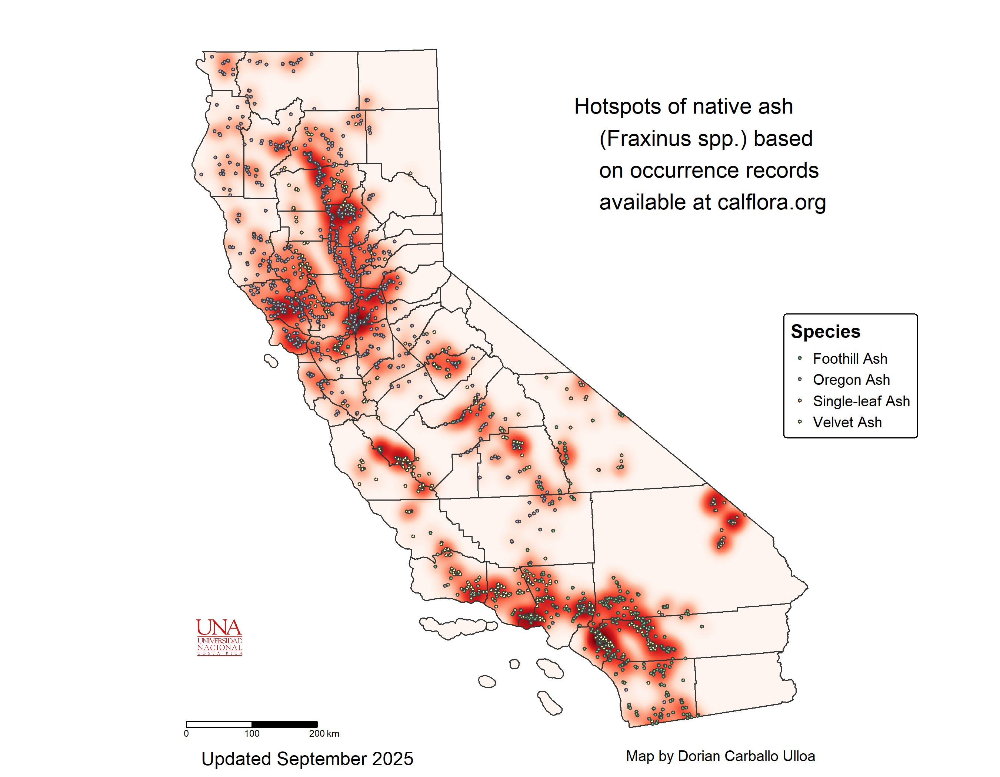

# Dorian Carballo Ulloa
 

## Brief Description
I am a biology student passionate about hydrology, herpetofauna, birds, and bats. Constantly motivated to learn more about biodiversity, with a strong interest in contributing to environmental education and promoting species conservation.

## Experience
1. **Assistant, Environmental Hydrology Program, UNA** (2024 - Present)  
   Work includes water analysis, field trips to watersheds, and risk assessment due to pollutants.

2. **Assistant, OVSICORI** (2021 - Present)  
   Sample preparation, petrological analysis, and fieldwork on volcanoes.

3. **Volunteer, Río Loro Environmental Park** (2023 - Present)  
   Handling herpetofauna and bats, bird counting, and environmental education.

4. **Assistant, Dr. Jara Veterinary Clinic** (2024 - Present)  
   Care, bathing, and handling of domestic species.

## Projects
* Wildlife monitoring using camera traps  
* Bat monitoring through mist nets and bioacoustics  
* Environmental education in urban and rural contexts  
* Participation in scientific symposia and workshops  

## Education
* **Bachelor's in Biology with an emphasis in Tropical Biology**  
  National University of Costa Rica — *Ongoing*  
* **High School Diploma**  
  Seráfico San Francisco School, 2020

## Languages
* Spanish: Native  
* English: Intermediate  

## Hobbies
* Hiking  
* Nature photography  
* Science communication  
* Reading about ecology and conservation  

## Contact Information
[**Email**](mailto:dorian.carballo.ulloa@gmail.com)  
[**Instagram**](https://instagram.com/dorian.cu)  
[**ORCID**](https://orcid.org/0009-0006-5233-0687)

---
# Some of My Work 

### Figure 1. Comparison of habitat suitability for *Artibeus lituratus* according to the GLM and Maxnet models, using a color gradient to represent habitat suitability. In the GLM panel, red dots indicate species occurrences, while in the Maxnet panel, black dots indicate species occurrences.
 

### Figure 2. Hotspots of native ash (*Fraxinus spp.*) based on occurrence records available at calflora.org.
 

### Figure 3. Cantonal distribution of *Craugastor fitzingeri* observations in Costa Rica.
 

<video width="480" height="320" controls>
  <source src="videos/mi_video" type="video/mp4">
</video>

[Visit GitHub](https://github.com/DorianCarballoU/Dorian_CarballoU.github.io)
